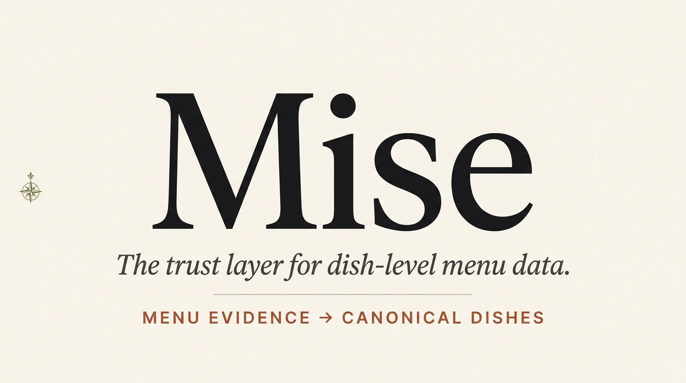
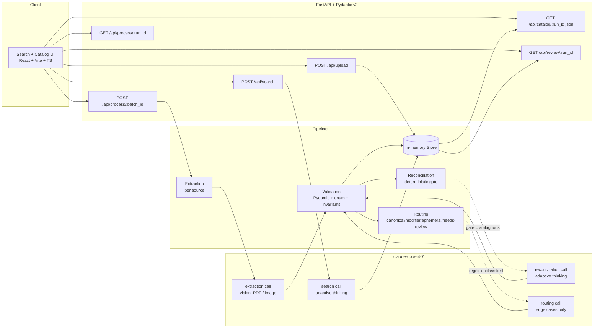

<p align="center">
  
</p>

<p align="center">
  <em>Any menu. Any language. Ask like a customer.</em>
</p>

<p align="center">
  <a href="#why-mise-exists">Why</a> ·
  <a href="#what-it-does">What it does</a> ·
  <a href="#the-json-catalog">JSON catalog</a> ·
  <a href="#architecture">Architecture</a> ·
  <a href="#plug-it-into-anything">Integrations</a> ·
  <a href="#quickstart">Quickstart</a> ·
  <a href="docs/demo_script.md">Demo</a> ·
  <a href="docs/evals.md">Evals</a>
</p>

<p align="center">
  
  
  
  
  
  
</p>

---

## Why Mise exists

Every food product — delivery app, review platform, POS, dish-reviews side-project — eventually hits the same wall: **menus are unstructured**. PDFs, phone photos, chalkboards, Instagram specials, in three languages, with typos, with branch-level variations, with modifiers that look like dishes and dishes that look like modifiers. Somebody then spends weeks manually loading that catalog into their system, one restaurant at a time.

Mise removes that wall.

**Drop any menu. Get a searchable dish graph.** A JSON catalog with canonical names, prices, ingredients, and the *natural-language handles* a diner actually types — `mila napo`, `napo con papas`, `burger doble cheddar`, `quesa simple`. Then plug that catalog into anything: a search box, a delivery feed, a POS import, a review app.

It is not OCR. It is a **dish-understanding engine** powered by `claude-opus-4-7` — vision-native, identity-aware, and search-ready by construction.

## What it does

1. **Ingests** multi-source menu evidence — PDFs, photos, chalkboards, social posts, in any language — directly to Opus 4.7 vision. No external OCR in the critical path.
2. **Extracts** dish candidates with typo correction, reordered-compound normalization, and the diner-vernacular aliases and search terms — from a single Opus 4.7 structured-output call per source.
3. **Reconciles** candidates across sources through a deterministic prefilter that escalates only ambiguous pairs to Opus 4.7 with **adaptive thinking**, so one dish stays one dish across branches and typos.
4. **Routes** edge cases deterministically — `canonical` · `modifier` · `ephemeral` · `needs-review` — so a delivery feed never shows "add burrata +3" as a standalone item.
5. **Serves it back** two ways: a natural-language **search** endpoint (`POST /api/search`) that takes "algo abundante con queso" and returns the right dishes, and an **export** endpoint (`GET /api/catalog/:run_id.json`) with the full catalog ready to plug into any system.

## The JSON catalog

The primary output. One endpoint, one shape, zero custom integration per restaurant:

```json
{
  "id": "dish-abc123",
  "canonical_name": "Milanesa Napolitana",
  "price": { "value": 8500, "currency": "ARS" },
  "aliases": ["Mila Napo", "Milanesa a la Napolitana", "Napolitana"],
  "search_terms": ["mila napo", "napo con papas", "milanesa abundante con queso y jamon"],
  "ingredients": ["breaded beef", "tomato", "mozzarella", "ham"],
  "modifiers": [{ "name": "add papas rústicas", "price_delta": 1200 }],
  "sources": [{ "filename": "menu_pdf.pdf", "span": "p3" }],
  "confidence": 0.92
}
```

Every restaurant tech company re-invents this shape manually. Mise generates it from a photo.

## Identity reasoning — why the search works

The search is only as good as the identity graph underneath it. These four demo decisions — anchored in the eval harness and the video — prove the identity layer holds up:

| Evidence | Decision | Why it matters for search |
|---|---|---|
| `Marghertia` (typo, Branch A) · `Margherita` (Branch B) · `+burrata` (Branch C) | **Merged** as `Margherita`, typo becomes an alias, burrata becomes a modifier | A query for "margarita con burrata" resolves to one dish, not three partial matches |
| `Pizza Funghi` · `Calzone Funghi` (identical ingredients) | **Kept separate** | Query "funghi sin masa cerrada" correctly returns the pizza, not the calzone |
| `add burrata +3` on a chalkboard | Routed as **modifier** attached to `Margherita` | Search never surfaces "add burrata" as a dish, and "margherita con burrata" composes the modifier into the result |
| `Chef's Special` from an Instagram post | Routed as **ephemeral** | The catalog doesn't fossilize a one-night special into a permanent dish |

## Architecture



Four deterministic layers plus two read surfaces. Opus 4.7 is **core-guaranteed** in four of them — extraction per source (structured output with diner-vernacular aliases and search terms), reconciliation on ambiguous pairs (adaptive thinking), routing of edge cases (`modifier` / `ephemeral` / `needs-review`), and natural-language search over the dish graph.

## Plug it into anything

The dish graph is the product. Every integration is the same two steps:

1. `POST /api/upload` → `POST /api/process/:batch_id` with the restaurant's menus.
2. `GET /api/catalog/:run_id.json` → drop the JSON into your system.

Three concrete integrations the demo targets:

| Target | What they need | What Mise gives them |
|---|---|---|
| **Review & discovery apps** onboarding a restaurant | Canonical dishes, aliases for user-typed reviews, stable IDs across branches | The full catalog. A reviewer typing "mila napo" matches the canonical "Milanesa Napolitana" via `search_terms`. |
| **Delivery platforms** importing non-POS restaurants (Rappi / PedidosYa / Uber Eats) | Item list with prices, grouped modifiers, no ephemeral specials polluting the menu | `canonical` items with `price`, `modifiers[]`, and `ephemeral` items filtered out at ingest. |
| **POS / catalog migrations** | Dedup across branch menus, typo normalization, structured modifiers | Reconciled items with typos folded into `aliases`, branch variants merged, modifiers attached. |

The catalog is versioned per `run_id`, so re-uploading a new menu produces a diffable JSON the downstream system can apply as an update.

## Stack

- **Frontend** — React 18 · Vite 5 · TypeScript (strict, no `any`) · Tailwind v4 with `@theme` tokens · shadcn/ui · Fraunces / Instrument Serif / IBM Plex Sans / IBM Plex Mono
- **Backend** — Python 3.11+ · FastAPI 0.115 · Pydantic v2 · uvicorn · pytest
- **AI** — Anthropic Messages API with `claude-opus-4-7`. No LangChain, no LlamaIndex, no external OCR, no orchestration wrappers.
- **Storage** — process-local in-memory store. A stable JSON catalog is the external contract; persistence is intentionally out of scope for the MVP.

## Quickstart

Requirements — Node 20+, Python 3.11+, an Anthropic API key with access to `claude-opus-4-7`.

```bash
# 1. Clone and configure
git clone https://github.com/NicoArce10/Mise.git
cd Mise
cp .env.example .env      # then fill ANTHROPIC_API_KEY

# 2. Backend
cd backend
python -m venv .venv
.venv\Scripts\activate                       # Windows PowerShell
#  source .venv/bin/activate                 # macOS / Linux
pip install -r requirements.txt
pytest -q                                    # 21 tests should pass
uvicorn app.main:app --reload --port 8000    # in one terminal

# 3. Frontend
cd ../frontend
npm install
npm run dev                                  # in another terminal — http://127.0.0.1:5173

# 4. API smoke test against Opus 4.7 (required before Milestone 4)
cd ..
python scripts/smoke_api.py                  # exits 0 if the key works
```

Open the app at <http://127.0.0.1:5173>. Drop a menu PDF/photo on the landing TryIt panel → the pipeline runs → the dish graph appears with search ("algo abundante con queso"), aliases, and the full JSON catalog ready to export. The internal Review Cockpit (for auditing merge/split decisions) is available at <http://127.0.0.1:5173/cockpit>.

## Repository layout

```
Mise/
├── assets/         Banner and public visual assets
├── frontend/       Search + catalog UI, Cockpit audit view (Vite + React + TS)
├── backend/        FastAPI service (Pydantic v2, in-memory store)
├── evals/          Synthetic golden set + harness + reports
│   └── datasets/   bundle_01 italian · bundle_02 taqueria · bundle_03 bistro
├── docs/           Product, architecture, design, evals contract
├── scripts/        smoke_api.py + eval bundle generator
└── submissions/    Video link, written summary, metrics JSON
```

## Documentation

- [`docs/product.md`](docs/product.md) — product brief
- [`docs/demo_script.md`](docs/demo_script.md) — three-minute shot list
- [`docs/cockpit_visual_direction.md`](docs/cockpit_visual_direction.md) — editorial / cartographic design tokens
- [`docs/evals.md`](docs/evals.md) — evaluation harness specification
- [`docs/competitive_benchmark.md`](docs/competitive_benchmark.md) — how to reproduce the Mise vs Veryfi / Klippa comparison on your own hardware, with your own credentials
- [`docs/references.md`](docs/references.md) — notes and sources

## For hackathon judges

If you are reviewing this submission:

1. **Demo video** — link in [`submissions/README.md`](submissions/README.md)
2. **Written summary** — [`submissions/written_summary.md`](submissions/written_summary.md)
3. **Measured metrics** — [`submissions/metrics.json`](submissions/metrics.json), reproducible via `python evals/run_eval.py --bundle all`
4. **Competitive benchmark** — reproducible side-by-side with Veryfi (requires your own Veryfi API key): `python evals/run_competitor_bench.py --bundle bundle_01_italian --mise-mode real --with-veryfi`. Methodology: [`docs/competitive_benchmark.md`](docs/competitive_benchmark.md).
5. **Try it live** — the Quickstart above is copy-pasteable; smoke-test completes in under a minute.

Every quantitative claim in the demo video is produced by `evals/run_eval.py` or `evals/run_competitor_bench.py`. If a number isn't in one of those reports, it isn't in the video. The contract is in [`docs/evals.md`](docs/evals.md).

## License

MIT — see [`LICENSE`](LICENSE). All assets in this repository are original or properly licensed.

<p align="center">
  <sub>Built for the Claude Opus 4.7 Hackathon — April 2026.</sub>
</p>
