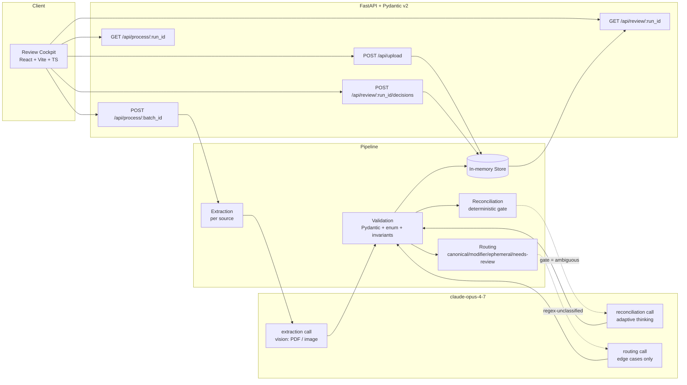

<p align="center">
  
</p>

<p align="center">
  <em>Three messy sources in. One trustworthy dish record out.</em>
</p>

<p align="center">
  <a href="#quickstart">Quickstart</a> ·
  <a href="#architecture">Architecture</a> ·
  <a href="#demo-critical-decisions">Demo decisions</a> ·
  <a href="docs/demo_script.md">Demo script</a> ·
  <a href="docs/evals.md">Evals</a> ·
  <a href="docs/judging_strategy.md">Judging strategy</a>
</p>

<p align="center">
  
  
  
  
  
  
</p>

<p align="center">
  
  
  
  
  
  
</p>

---

## Why Mise exists

Food products do not fail because menus are unavailable. They fail because **dish identity fragments** across PDFs, screenshots, chalkboards, social posts, branch-level variations, typos, and modifiers. When identity breaks, search breaks, rankings go noisy, analytics split across duplicates, and catalog operations become manual.

Mise is the **trust layer** upstream of menu management. It ingests noisy evidence and produces canonical, reviewable dish records with **provenance, confidence, and a decision summary for every merge or split**.

It is not OCR. It is **identity reasoning under ambiguity**, powered by `claude-opus-4-7`.

## What it does

1. **Ingests** multi-source menu evidence — PDFs, photos, chalkboards, social posts — directly to Opus 4.7 vision. No external OCR in the critical path.
2. **Extracts** dish candidates from each source with structured output validated by Pydantic.
3. **Reconciles** candidates through a deterministic prefilter that only escalates ambiguous pairs to Opus 4.7 with **adaptive thinking**.
4. **Routes** edge cases deterministically — `canonical` · `modifier` · `ephemeral` · `needs-review`.
5. **Presents** the Review Cockpit with decision summaries, provenance back to every source, and a confidence score per decision.

## Demo-critical decisions

These four decisions anchor the demo video and the evaluation harness. Every decision surfaces with provenance and a human-readable summary.

| Evidence | Decision | Why |
|---|---|---|
| `Marghertia` (typo in Branch A) · `Margherita` (Branch B) · `+burrata` (Branch C) | **Merged** as `Margherita`, typo becomes an alias, burrata becomes a modifier | Name matches after typo normalization; ingredients match across two branches |
| `Pizza Funghi` · `Calzone Funghi` (identical ingredients) | **Kept separate** | Dish type differs despite ingredient overlap |
| `add burrata +3` on a chalkboard | Routed as **modifier** attached to `Margherita` | Matches `add <ingredient> <±price>` under an extras heading |
| `Chef's Special` from an Instagram post | Routed as **ephemeral** | No stable name across sources, no fixed price |

## Architecture



Four deterministic layers. Opus 4.7 is **core-guaranteed** in two of them (extraction per source; reconciliation on ambiguous pairs) and **optional** in one (routing, only for regex-unclassified lines). The deterministic reconciliation gate is specified in [`docs/plans/2026-04-22-architecture.md`](docs/plans/2026-04-22-architecture.md) §2.1.

## Stack

- **Frontend** — React 18 · Vite 5 · TypeScript (strict, no `any`) · Tailwind v4 with `@theme` tokens · shadcn/ui · Fraunces / Instrument Serif / IBM Plex Sans / IBM Plex Mono
- **Backend** — Python 3.11+ · FastAPI 0.115 · Pydantic v2 · uvicorn · pytest
- **AI** — Anthropic Messages API with `claude-opus-4-7`. No LangChain, no LlamaIndex, no external OCR, no orchestration wrappers.
- **Storage** — process-local in-memory store. External DB is **frozen out of scope** — see [`docs/scope_freeze.md`](docs/scope_freeze.md).

## Quickstart

Requirements — Node 20+, Python 3.11+, an Anthropic API key with access to `claude-opus-4-7`.

```bash
# 1. Clone and configure
git clone https://github.com/NicoArce10/Mise.git
cd Mise
cp .env.example .env      # then fill ANTHROPIC_API_KEY

# 2. Backend
cd backend
python -m venv .venv
.venv\Scripts\activate                       # Windows PowerShell
#  source .venv/bin/activate                 # macOS / Linux
pip install -r requirements.txt
pytest -q                                    # 21 tests should pass
uvicorn app.main:app --reload --port 8000    # in one terminal

# 3. Frontend
cd ../frontend
npm install
npm run dev                                  # in another terminal — http://127.0.0.1:5173

# 4. API smoke test against Opus 4.7 (required before Milestone 4)
cd ..
python scripts/smoke_api.py                  # exits 0 if the key works
```

Open the Cockpit at <http://127.0.0.1:5173>. Click **New batch** → drop menu PDFs/photos → watch the pipeline advance → land on the Review Cockpit with the four demo-critical decisions. Click **Present** for the hero frame.

## Repository layout

```
Mise/
├── assets/                                   # Banner and public visual assets
├── frontend/                                 # Review Cockpit (Vite + React + TS)
├── backend/                                  # FastAPI service (Pydantic v2, in-memory store)
├── evals/                                    # Synthetic golden set + harness + reports
│   └── datasets/bundle_{01,02,03}/           # Italian trattoria · Taqueria · Modern bistro
├── docs/                                     # Product, strategy, design, and execution plans
│   └── plans/                                # Architecture plan + per-milestone implementation plans
├── scripts/                                  # smoke_api.py + eval bundle generator
├── submissions/                              # Video, written summary, metrics JSON
└── {1,2,3,4}st_prompt.md                     # Milestone entry points (Claude Code / agent use)
```

## Documentation

Strategy and contract:

- [`docs/product.md`](docs/product.md) — product brief
- [`docs/project_brief.md`](docs/project_brief.md) — deep brief for contributors
- [`docs/judging_strategy.md`](docs/judging_strategy.md) — how Mise targets the rubric
- [`docs/scope_freeze.md`](docs/scope_freeze.md) — authoritative MVP/out-of-scope decisions
- [`docs/hackathon_rules.md`](docs/hackathon_rules.md) — competition guardrails
- [`docs/acceptance_criteria.md`](docs/acceptance_criteria.md) — what must be true to submit

Design:

- [`docs/cockpit_visual_direction.md`](docs/cockpit_visual_direction.md) — editorial / cartographic design tokens
- [`docs/demo_script.md`](docs/demo_script.md) — three-minute shot list
- [`docs/demo_recording_plan.md`](docs/demo_recording_plan.md) — tooling and day-of workflow

Execution:

- [`docs/plans/2026-04-22-architecture.md`](docs/plans/2026-04-22-architecture.md) — frozen architecture contract (Milestone 1)
- [`docs/plans/2026-04-22-cockpit.md`](docs/plans/2026-04-22-cockpit.md) — Cockpit implementation plan (Milestone 2)
- [`docs/plans/2026-04-23-backend.md`](docs/plans/2026-04-23-backend.md) — Backend implementation plan (Milestone 3)
- [`docs/timeline.md`](docs/timeline.md) — day-by-day plan with buffer rules
- [`docs/preflight.md`](docs/preflight.md) — green-light checklist per milestone
- [`docs/evals.md`](docs/evals.md) — evaluation harness specification
- [`docs/extras.md`](docs/extras.md) — bonus prize strategy
- [`docs/submission_plan.md`](docs/submission_plan.md) — submission-day workflow

Agent orientation:

- [`AGENTS.md`](AGENTS.md) — read order, hard rules, skill matrix for AI agents working on this repo
- [`claude.md`](claude.md) — identity and scope summary for Claude sessions

## For hackathon judges

If you are reviewing this submission:

1. **Demo video** — link in [`submissions/README.md`](submissions/README.md)
2. **Written summary** — `submissions/written_summary.md`
3. **Measured metrics** — `submissions/metrics.json` (reproducible via `python evals/run_eval.py --bundle all`)
4. **Why Opus 4.7** — see [`docs/extras.md`](docs/extras.md) and the "Decisions" rail in the Cockpit

Every quantitative claim in the video comes from `evals/run_eval.py`. Any number not produced by that harness is not in the video. See [`docs/evals.md`](docs/evals.md) for the contract.

## License

MIT — see [`LICENSE`](LICENSE). All assets in this repository are original or properly licensed.

<p align="center">
  <sub>Built for the Claude Opus 4.7 Hackathon — April 2026.</sub>
</p>
